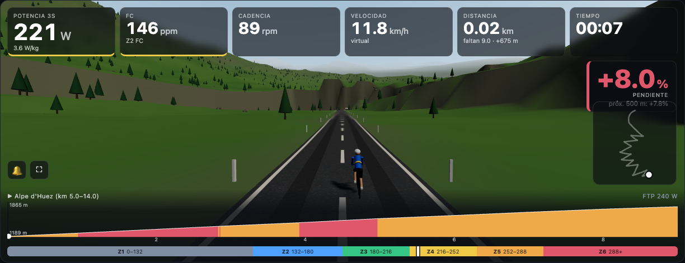
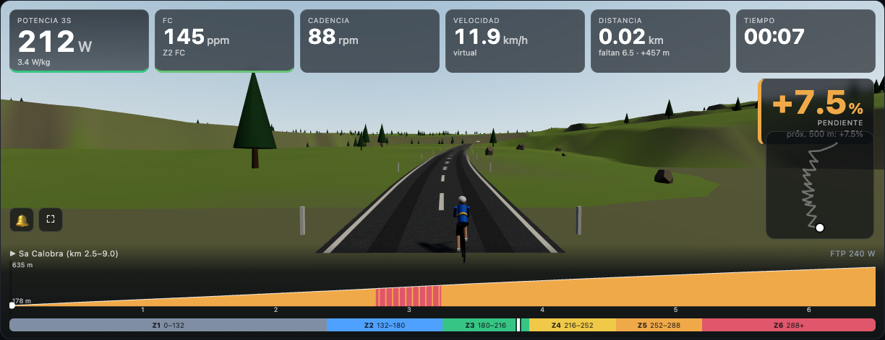

# rodillo

**App open source para entrenar en rodillo inteligente.** Conectás tu rodillo por Bluetooth, elegís una subida épica y la rodás en 3D: la resistencia sigue la pendiente real del camino. O cargás un workout y el rodillo maneja los watts por vos.

## 👉 Usala sin instalar nada: **[tomacho25.github.io/rodillo](https://tomacho25.github.io/rodillo/)**

Abrís el link en **Chrome o Edge** (computador o Android), apretás **🔗 Conectar rodillo** y listo. Sin cuenta, sin suscripción, sin instalar nada. ¿No tenés el rodillo a mano? Apretá **🎮 Probar sin rodillo**.

> En **iPhone/iPad** Safari no soporta Bluetooth web: usá la app gratuita **Bluefy** y abrí el mismo link ahí.





> **English:** use it right away at **[tomacho25.github.io/rodillo](https://tomacho25.github.io/rodillo/)** (Chrome/Edge, Web Bluetooth). Open-source app for smart trainers (Bluetooth FTMS). Ride epic climbs in 3D with grade simulation, run ERG workouts scaled to your FTP, and export every session as TCX for Garmin Connect or Strava. Runs locally in your browser — no account, no subscription. The UI is in Spanish.

## Qué hace

- **Modo Ruta:** el rodillo simula la pendiente (como Zwift) y la velocidad sale de la física: tus watts, tu peso, el aire y la pendiente. La dificultad es ajustable (por defecto, 50 %).
- **12 rutas épicas recreadas:** Alpe d'Huez (21 virajes), Mont Ventoux, Stelvio (48 tornantes), Tourmalet, Galibier, L'Angliru, Sa Calobra, Las 40 Curvas de Farellones, Los Caracoles de Portillo, Volcán Osorno, y dos inventadas: Ruta de los Volcanes y Costanera del Pacífico. Cada una trae carteles de curva, pueblos, hitos de km y arco de meta con público.
- **Tus GPX:** subís cualquier GPX con altura y lo rodás.
- **Workouts en ERG:** una biblioteca de 16 workouts en % de FTP (Z2, tempo, sweet spot, over-unders, VO2máx, test de FTP…), además de JSON propios o `.fit` de Garmin. Incluye cuenta regresiva 3-2-1, aviso de "en objetivo" y tu potencia dibujada sobre los bloques.
- **Workout sobre una ruta:** el rodillo sigue en ERG, pero avanzás por el Alpe con física real.
- **"¿Cuánto tiempo tenés?":** filtra rutas y workouts por duración y estima cuánto vas a tardar a tu ritmo.
- **Escena 3D** con [three.js](https://threejs.org): terreno y paisaje por ruta (Alpes, Provenza, Andes, lagos, costa), cielo según la hora real (de noche hay estrellas y foco), y un ciclista que pedalea a tu cadencia, se para en las subidas duras y se inclina en las curvas. Si tu navegador no tiene WebGL, se usa una versión 2D.
- **Sesiones en TCX:** cada sesión queda guardada y la descargás para subirla a Garmin Connect o Strava. En modo Ruta, el TCX lleva el recorrido GPS.

## Primeros pasos

La primera vez la app te pide tres datos:

| Dato | Para qué | ¿No lo sabés? |
|---|---|---|
| **Peso** | Velocidad en subida (con los mismos watts, más liviano = más rápido) y W/kg | Pesate 🙂 |
| **FTP** | Tus zonas de potencia y los watts de todos los workouts | Apretá **“Estimar con mi peso”** (≈2,5 W/kg) y después hacé el **FTP Test 20min** (Workout → Test): al terminar, la app calcula tu FTP (95% de tus 20′) y te ofrece guardarlo |
| **FC máxima** | Tus zonas de frecuencia cardíaca | Poné tu edad y apretá **“Estimar”** |

**Los watts no los tenés que saber:** los mide el rodillo. Se cambian cuando quieras en **⚙ Ajustes**.

Cada sesión queda guardada (en la web, dentro de tu navegador) y la descargás como **TCX** para subirla a **Garmin Connect** (Importar datos) o **Strava** (Subir actividad).

## Instalarla en tu computador (opcional)

La versión web alcanza para entrenar. Instalar la versión con Python sirve si querés usar Safari/Firefox, cargar workouts `.fit` o guardar las sesiones como archivos.

## Requisitos

- Python 3.11 o superior
- Un **rodillo inteligente con Bluetooth FTMS**. Lo probamos con un **Tacx Flux S**, y la mayoría de los rodillos actuales (Wahoo, Elite, JetBlack, Saris…) hablan FTMS.
- Opcional: una **banda de frecuencia cardíaca Bluetooth**.

## Instalación

```bash
git clone https://github.com/Tomacho25/rodillo.git
cd rodillo
python3 -m venv .venv && source .venv/bin/activate
pip install -e .
```

## Uso

```bash
rodillo --sim        # probar sin rodillo (simulador)
rodillo              # busca tu rodillo por Bluetooth y conecta
rodillo --no-hr      # sin banda de FC
rodillo --address XX:XX:...   # conectar a un rodillo específico
```

Se abre `http://127.0.0.1:8765/`. La primera vez te pide **FTP, peso y FC máxima**: con eso se calculan las zonas, los watts de los workouts y la velocidad virtual.

**Importante:** el rodillo acepta **una sola conexión Bluetooth**. Cerrá Zwift, la app del fabricante o Garmin Express antes de conectar. Si el rodillo no responde a la resistencia, pedaleá unas vueltas y apretá "Tomar control" (en *Avanzado*).

## Tus datos

Todo queda en tu computador, en `~/.rodillo/` (o en la carpeta que indiques con `RODILLO_HOME`):

```
~/.rodillo/
  settings.json   FTP, peso, FC máxima
  routes/         tus GPX
  sessions/       cada sesión: .csv (todas las muestras), .tcx y .json (resumen)
```

## Desarrollo

```bash
pip install -e ".[dev]"
pytest
```

| Archivo | Qué hace |
|---|---|
| `rodillo/trainer/client.py` | Conexión FTMS: ERG, simulación de pendiente, lectura de datos |
| `rodillo/trainer/ride.py` | Perfiles de ruta, física de velocidad virtual, `RidePlayer` |
| `rodillo/trainer/workout.py` | Workouts y `WorkoutPlayer` (ERG por bloques) |
| `rodillo/server/epic_routes.py` | Generador de las rutas épicas (zigzags numerados, pueblos, paisaje) |
| `rodillo/server/static/scene3d.js` | Escena 3D (three.js r169, sin build, en `static/vendor/`) |
| `rodillo/server/static/rig.js` | HUD, modos y escena 2D de respaldo |
| `rodillo/server/static/engine.js` | Versión web: el "servidor" dentro del navegador (Web Bluetooth FTMS, workouts, rutas, sesiones en IndexedDB) |
| `scripts/build_web.py` | Arma la versión web en `site/` (la publica GitHub Actions en GitHub Pages) |

## Aclaraciones

- **Las rutas épicas son recreaciones aproximadas:** largo, desnivel y número de curvas salen de datos públicos conocidos, pero no son el trazado GPS real.
- **No tiene relación con Zwift, Garmin, Tacx ni Strava.** Esos nombres se mencionan solo como referencia de compatibilidad, y son marcas de sus dueños.
- **La velocidad virtual es una estimación física**, no la del volante del rodillo.

## Licencia

[MIT](LICENSE). three.js también es MIT.
